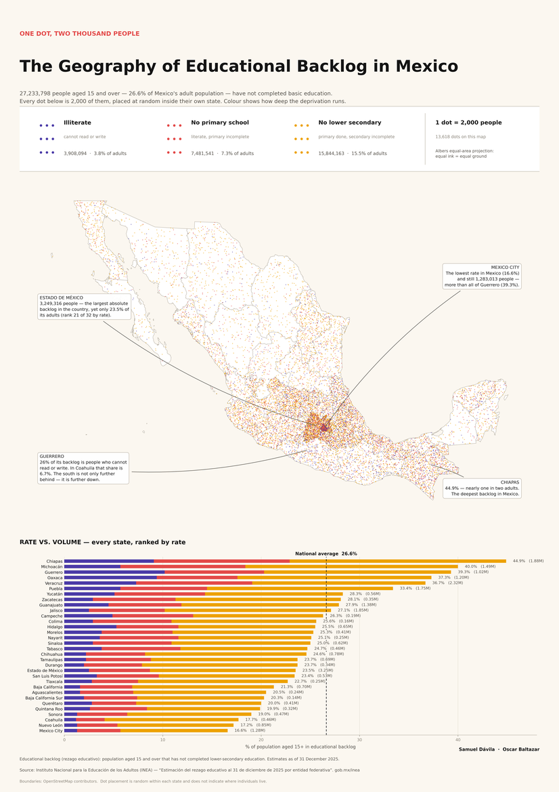

# One Dot, Two Thousand People

**The Geography of Educational Backlog in Mexico** — a dot-density map built from official INEA
estimates (31 December 2025), exported as a print-ready A2 poster.

Application exercise 2 — *Mapping inequality*. Samuel Dávila · Oscar Baltazar.



## The idea

27,233,798 Mexican adults — 26.6% of the adult population — have not completed basic education. A
choropleth of that statistic can only show a *rate*, and the rate hides the people: Mexico City has the
best rate in the country (16.6%) and still contains more people in backlog than the whole of Guerrero
(39.3%).

So each dot on this map is **2,000 people**, placed at random inside their own state — density carries
volume. Dot **colour** carries the *depth* of the backlog (illiterate / no primary / no lower secondary),
which turns out to vary sharply by region: in Guerrero 26% of those in backlog cannot read or write, in
Coahuila 6.7%. A ranked stacked-bar panel restores the rate, so both readings sit on one sheet.

The projection is **Albers Equal-Area Conic**, because in a dot map area is the denominator — equal ink
must mean equal ground.

## Layout

```
data/       est_rez_ent_2025.xlsx   raw INEA workbook
            mx.json                 state boundaries (GeoJSON)
notebooks/  dot_density_map.ipynb   the full method, executed with outputs
output/     rezago_dotmap_A2.pdf    ← print this one (vector, A2)
            rezago_dotmap_A2.png    4960 × 7015 px @ 300 dpi
            rezago_educativo_2025_tidy.csv
REPORT.md   the one-page write-up
```

## Reproducing

```bash
pip install -r requirements.txt
jupyter lab notebooks/dot_density_map.ipynb   # run all
```

The random seed is fixed, so the dot pattern is identical on every run.

## Printing

Take `output/rezago_dotmap_A2.pdf` to the print shop and ask for **A2 (42 × 59.4 cm), no scaling,
100%**. It is vector, so it stays sharp at any size. Matte or uncoated stock suits the warm paper
background better than gloss.

## Source

Instituto Nacional para la Educación de los Adultos (INEA), Dirección de Prospectiva, Acreditación y
Evaluación — *Estimación de la población de 15 años y más en rezago educativo por entidad federativa, al
31 de diciembre de 2025*.
<https://www.gob.mx/inea/documentos/estimaciones-del-rezago-educativo-al-31-de-diciembre-de-2025>

Boundaries: OpenStreetMap contributors.
